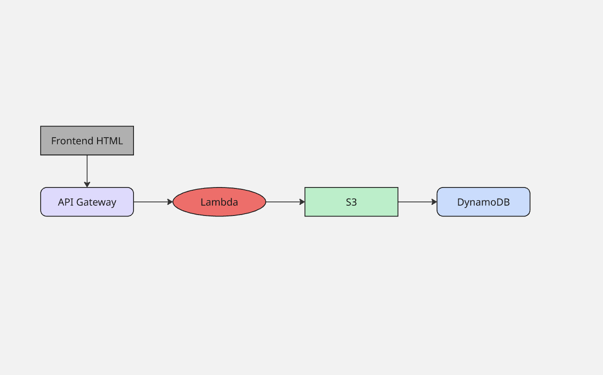

# AWS Serverless File Uploader

A simple serverless app to upload files to AWS S3, with metadata stored in DynamoDB and Lambda handling the logic.

## Architecture

## Features
- Upload files via Lambda-backed API Gateway
- Store files in S3
- Save metadata in DynamoDB
- Optional frontend for file uploads

## Services Used
- **S3**: Stores uploaded files
- **Lambda**: Handles upload logic
- **DynamoDB**: Stores metadata
- **API Gateway**: Exposes Lambda as HTTP API

## How to Deploy
1. Create S3 bucket  
2. Create DynamoDB table  
3. Create IAM Role for Lambda with S3 + DynamoDB permissions  
4. Deploy Lambda function  
5. Create HTTP API → integrate with Lambda → deploy stage  

## Screenshots
- Lambda function
- API test
- S3 bucket with files
- DynamoDB metadata table
- Frontend page (optional)

